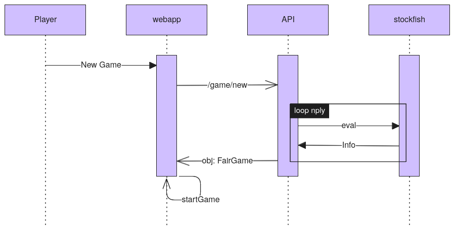

# Jumbo Mana - Technical test

## Test description

A chess game is divided into 3 parts : the opening, the mid game and the final. Openings
are only learned by rote, which limits strategic interest. The purpose of this exercise is to
create a server capable of generating random chess position where black and white are
equals, to initiate the mid game.

**Back-end**  
To create this service, you will develop an API on Python with the FastAPI framework. The
back-end needs to generate only fair chess positions. For that, you will use stockfish to
determinate if the position is equal.

**Front-end**  
A simple front-end will be developing to interact with the back-end and show random fair
chess positions.

## Thought process

- Search if a solution to a similar problem exists [](https://codepen.io/mherreshoff/full/MWJGwZN) [](https://github.com/mherreshoff/fair-chess/tree/main)
- Understand stockfish [](https://official-stockfish.github.io/docs/stockfish-wiki/Home.html) 
  - Communicate with the engine with the UCI protocol.
  - Can use the `eval` command to get the current position's static evaluation.

- basic architecture

The user requests a new game. The webapp queries the API for a fair starting position.
Upon receiving the requests, the API asks stockfish to propose muliple moves with the `eval` command, 
selects the one giving the smallest advantage to the current player, and applies it to the board.
Starting from this new position, the API queries stockfish for new moves, keeping again the move giving the smallest advantage.
This process repeats for a minimum of `min_ply` moves (decided by the user), and until a position giving an advantage under 5 cp is found or `max_ply` has been reached.

- improvements
  - Generate fair boards ahead of time, and store them in a database. This way, the API can return a fair board instantly, without having to wait for stockfish to compute the best move.
  - Use an openings database to generate the first few moves of the game, reducing considerably the number of moves to compute.
  - Use the `go` command instead of `eval` to get better position evaluation.

## Getting started

The recommended way to run this project is using `docker` and `docker-compose`.
You will find detailed instructions on how to do so.

Instructions on how to run the project without `docker` are provided in each service's `README.md` ([webapp](./webapp/README.md), [api](./api/README.md)).

### Requirements

- [Docker](https://docs.docker.com/engine/install/)
- [Docker Compose](https://docs.docker.com/compose/install/)
- git

### Building

First, clone this repository:

```bash
git clone https://github.com/joscherrer/jumbo-mana-technical-test.git
cd jumbo-mana-technical-test
```

Docker install instructions can be found here : [](https://docs.docker.com/engine/install/)

To build the `webapp` and `api` images, you can either use `docker-compose` :

```bash
docker-compose build
```

Or build the images separately :

```bash
docker build -t webapp ./webapp/
docker build -t api ./api/
```

### Running

To run the project:

```bash
docker-compose up -d
```

The web application should be available at [http://localhost:8000](http://localhost:8000).
The API docs should be available at [http://localhost:8080/docs](http://localhost:8080/docs).
